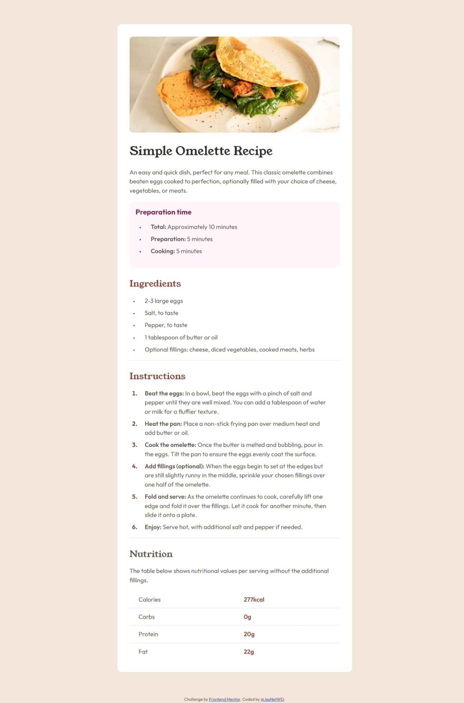

# Frontend Mentor - Recipe page solution

This is a solution to the [Recipe page challenge on Frontend Mentor](https://www.frontendmentor.io/challenges/recipe-page-KiTsR8QQKm). Frontend Mentor challenges help you improve your coding skills by building realistic projects.

## Table of contents

- [Overview](#overview)
  - [The challenge](#the-challenge)
  - [Screenshot](#screenshot)
  - [Links](#links)
- [My process](#my-process)
  - [Built with](#built-with)
  - [What I learned](#what-i-learned)
  - [Continued development](#continued-development)
- [Author](#author)

## Overview

### Screenshot



### Links

- Solution URL: [Add solution URL here](https://your-solution-url.com)
- Live Site URL: [Live site URL](https://jesnetwd.github.io/Frontend-Mentor-Recipe-page/)

## My process

### Built with

- Semantic HTML5 markup
- CSS custom properties

### What I learned

I'm making better use of media queries in CSS as well as semantic HTML. I also did better in planning this project than in previous ones.

```css
:root {
  --background-color: hsl(330, 100%, 98%);
  --recipe-background-color: hsl(0, 0%, 100%);
  --title-color: hsl(24, 5%, 18%);
  --color: hsl(30, 10%, 34%);
  --heading1: hsl(332, 51%, 32%);
  --heading2: hsl(14, 45%, 36%);
  --border: hsl(30, 18%, 87%);
}

@media (max-width: 600px) {
  .recipe {
    max-width: 100%;
    margin: 0;
    padding: 0;
    border-radius: 0;
  }

  section,
  p {
    margin: 20px;
  }

  .recipe-thumbnail {
    border-radius: 0;
  }

  h1 {
    margin-left: 20px;
  }
}

@media (min-width: 601px) and (max-width: 800px) {
  .recipe {
    max-width: 60%;
  }
}
```

### Continued development

I hope to write cleaner code in the future.

## Author

- LinkedIn - [Jessica Nwoye](https://www.linkedin.com/in/jessica-nwoye-45330b311/)
- Frontend Mentor - [@JesNetWD](https://www.frontendmentor.io/profile/JesNetWD)
